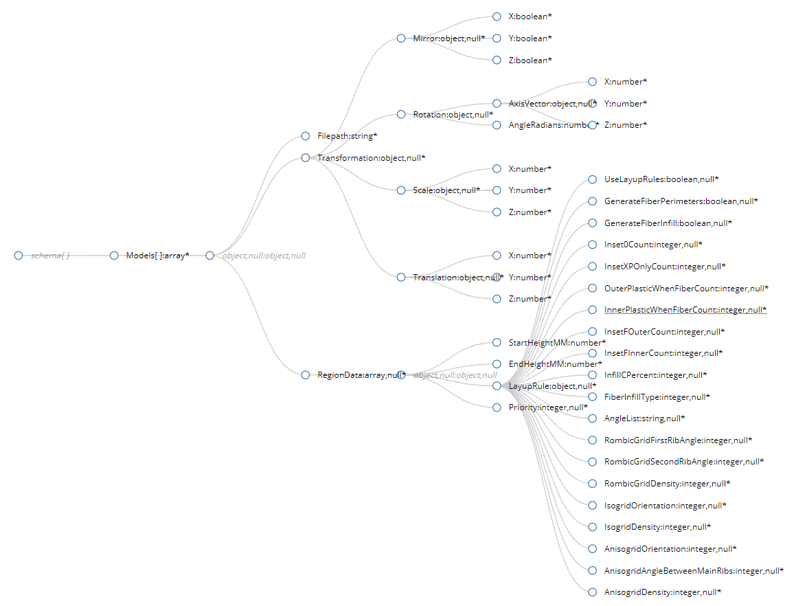

# Aura CLI
Alpha version of Aura CLI is included in Aura 1.24 and later. Aura.CLI.exe is located in the Aura program directory.

## Usage
Process g-code for model:  
````aura.cli --center --models part.stl --output part.gcode --session settings.aus````  
Process g-code for several models:  
````aura.cli --models part.stl part2.stp --output part.gcode --session settings.aus````  
Process g-code with custom layup rules for parts:  
````aura.cli --input parts-data.json --output part.gcode --session settings.aus````

Use *File->Export session...* in Aura to save session file with current slicing settings.

## Parameters
Parameter   | Description
--------------------|--------------------------------------
-m, --models        | (Group: parts) Model files to slice, several filenames should be separated by spaces.  
-i, --input         | (Group: parts) Input data file with information about models and layups in JSON format.  
-s, --session       | Required. Session file with slicing settings in JSON format.  
-o, --output        | Required. Output file.  
-c, --center        | In case of single part put it to the center of the buildplate.  
-f, --force         | Overwrite existing output file.  
--help              | Display help screen.  
--version           | Display version information.  

## Json input format
You can specify a list of models with layup regions and transformations using *--input* parameter.
The JSON Schema for the input file can be found in *cli-inputfile.schema.json*, which is located in the Aura program directory.



