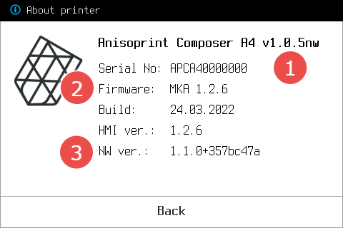

# Before you start

This document contains important points that ***each user has to be fimiliar with*** before starting working with Aura.Connect

## Usage hazards

::: danger
There are certain scenarios which can be dangerous while using Aura.Connect and Composer printers. These scenarios and ways to prevent them are listed below
:::

### Sending commands via [Terminal](/aura-connect/gui/#terminal-interactive-control) mid print

While the [Terminal](/aura-connect/gui/#terminal-interactive-control) may be useful and seems harmless to use, it's dangerous to send commands to a printer that is currently printing, because the **commands that you send in such case will be put into a printer command queue and *won't execute immideately***, which can cause unwanted results or even a tragedy

::: tip SOLUTION
Don't send commands to a printer mid print, unless **you're sure it's safe** and you know what you're doing 
:::

### Printing without required materials or with incorrect materials

Starting a job remotely may cause you to forget to check the loaded materials on the printer's spools. This can lead to some spools not being loaded with the material required to perform a print. This kind of mistake will result in a failed print and/or a waste of materials

::: tip SOLUTION
Always make sure that the printer's spools are loaded with all the necessary materials required to perform a print
:::

### Not removing printed parts before subsequent prints

Printer's screen will notify the user when it's done printing. **You must remove the printed part from the buildplate, before pressing the 'OK' button on the printer's 'Finished' screen**. If you forget to do that, and start a new print - it will be printed over the part that's still on the buildplate, which can damage the printer or result in a bad print

::: tip SOLUTION
Before starting each print always make sure that the build plate is clean and does not contain any foreign object which can obstruct the print
:::

### Not ensuring the safety of a print when starting it remotely

Due to remote opeartion capability provided by Aura.Connect, you may forget to check if the printing area is safe for a print. There may be other people operating the buildplate or performing printer maintenance. If you start a print during that time, you could harm those people

::: tip SOLUTION
Always make sure that it's safe to start printing. No other people should be operating on the printer physically at the moment of starting a new print 
:::

### More safety!

Hazards described above are mostly possible due to the remote printer operation capabilities provided by Aura.Connect, but there are many more potential hazards, that may occur if the printer is used incorrectly

We **strongly encourage** you to familiarize yourself with the full list of potential hazards in the [Manual](https://support.anisoprint.com/composer/manual/#safety-instructions) 

## Compatible hardware and printer firmware

Before connecting your printer to Aura.Connect, please ensure that it meets the following requirements:
1. The machine has network capabilities (the machine version contains "nw", e.g. "1.0.5nw")
2. The machine firmware version is 1.2.6 or later 
3. The machine Network bridge software version is 1.1.1 or later (the update is finished on the printer restart, so please restart your printer before checking the version)

You can check everything on the machine on the About printer screen, which is located in the Maintenance menu.

The latest firmware can be downloaded [here](https://support.anisoprint.com/composer/firmware-downloads/). The Network bridge software is updated automatically if a printer is connected to the Internet, please refer to the [Manual](https://support.anisoprint.com/composer/manual/#network-bridge-software-updating) for more details. 

## Aura.Connect specific terminology

If, while reading the documentation, you're having troubles understanding the terminology, refer to [Aura.Connect terminology](/aura-connect/terminology/)