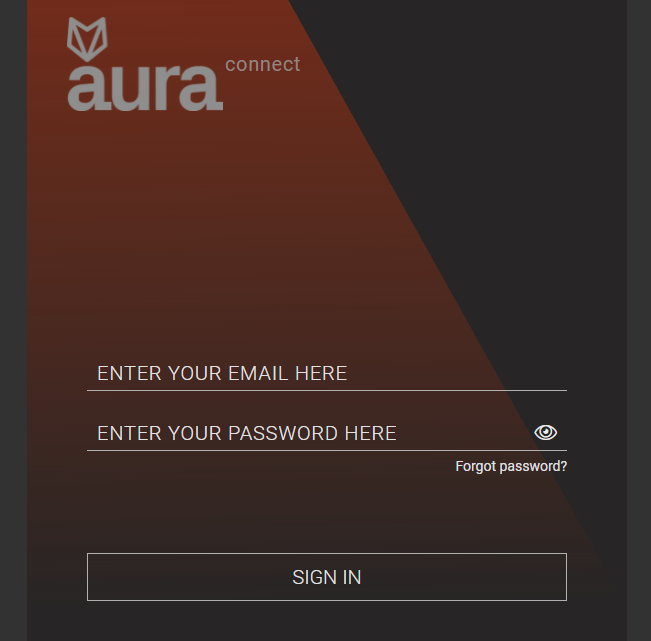
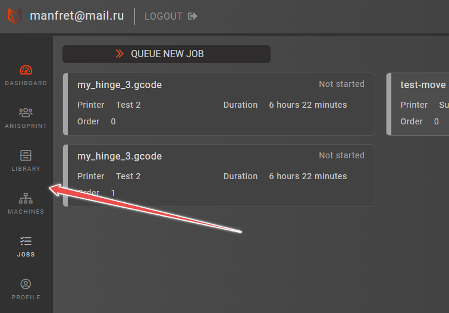
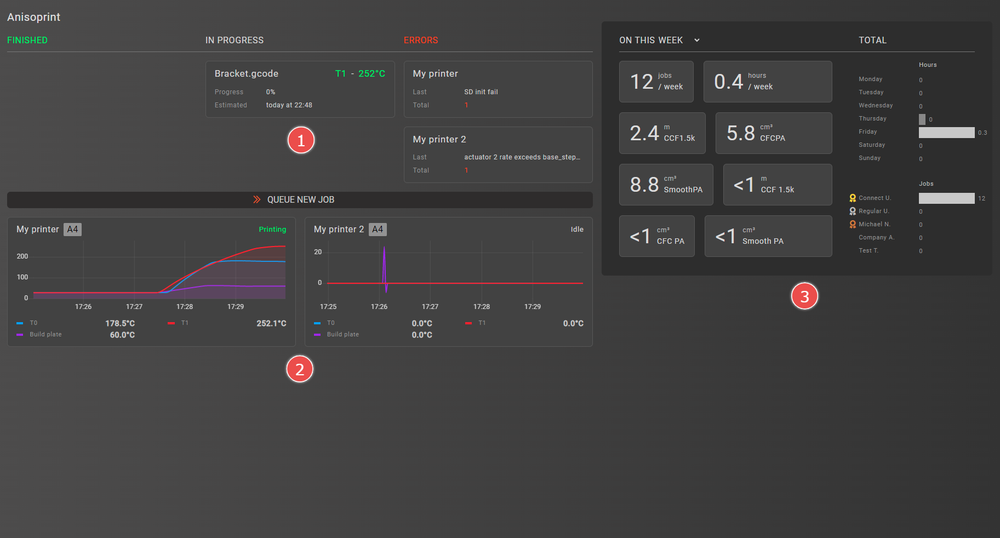
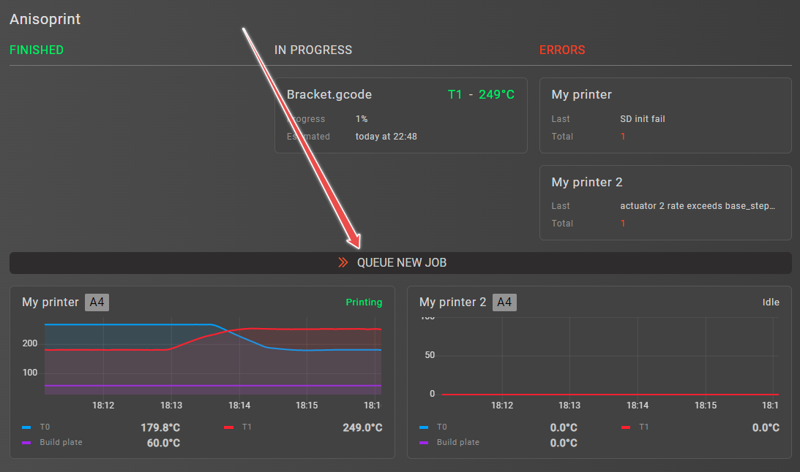
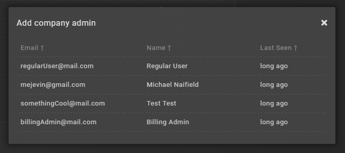
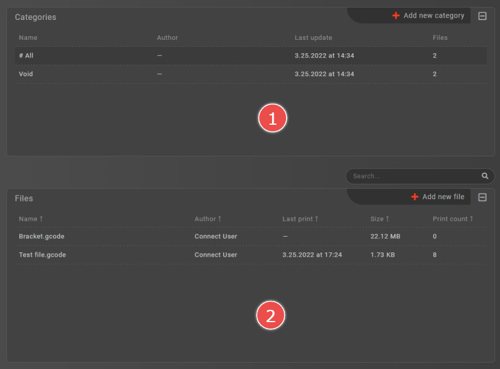
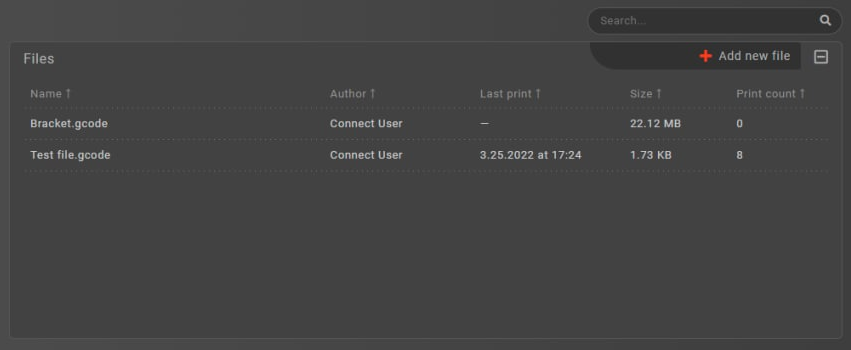
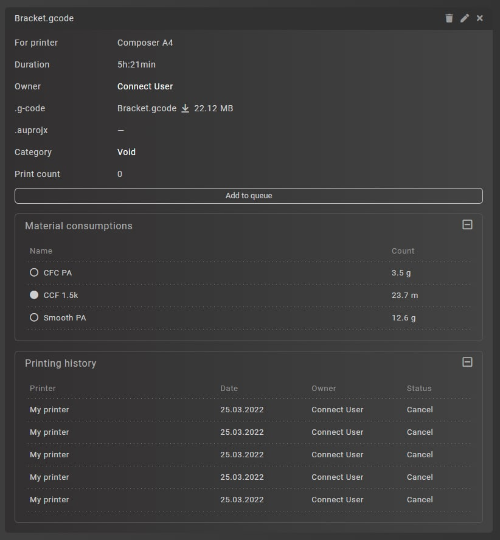

# GUI overview

This document will show and explain all parts of the user interface offered by Aura.Connect

## Login

The very first part of the user interface that every new user of Aura.Connect will see is the [Login](#login) screen

Although this UI element may be self explanitory, let's still go through its main parts 

### Sign in

The sign in screen allows you to perform authentication using your Aura.Connect credentials

In order to authenticate enter your email in the first field and your password in the second field, then click the **'Sign In'** button

### Forgot password

On the [Sign in](#sign-in) screen, there is the **'Forgot password'** button, which brings you to the forgot password screen, which looks like this

Here you will be able to reset your password, if you happen to forget it. All you need to do is enter your email in the field, then click the **'Send'** button

Shortly after you will receive a password recovery code on your email, which you can use to set a new password for your account in Aura.Connect

::: warning
Password recovery codes can expire. If your recovery code has expired, you can request a new one by following instruction above
:::

## Navbar

The static upper part of Aura.Connect is called a [Navbar](#navbar). Here you will be able to see your accounts' email, and logout.

### Logout

In order to logout click the **'Logout'** button, which is located after your email in the [Navbar](#navbar)

## Sidebar

The static left hand side part of Aura.Connect is called a [Sidebar](#sidebar). It contains all of the sections of Aura.Connect, which are available to your account

::: tip
Different account types in Aura.Connect have different section of Aura.Connect available to them. See [Account types]() for more information
:::

Let's go over each of the sections in more detail below

## Dashboard

Navigate to the [Dashboard](#dashboard) screen by clicking the **'Dashboard'** button located in the [Sidebar](#sidebar)

The dashboard section is often used as a quick summary of your company's statistics and for monitoring the current state of your printers. 

Dashboard is split into three main parts, listed below

### Printer summary

Shows the current state of printers added to your company is Aura.Connect. There are 3 groups the printers are split into, they include:

1. Finished
    - Shows all the printers that have finished printing and need a confirmation from the user on their screen
2. In progress
    - Shows all the printer that are currently printing
    - For each printing printer you will see
        1. G-Code file name, that's currently being printer
        2. Overall printing progress in percents, ranging from 0% to 100%
        3. Current tool being used by the printer, and that tools' temperature
3. Errors
    - Shows all the printes that have unacknowledged errors, and the last error that the printer has sent out

### Printer telemetry summary

Is consisted of printer cards, each printer card shows:

1. Telemetry data over the last 5 minutes (for connected printers only)
2. Printer state in the upper right corner 
3. Printer name
4. Printer model

::: tip
You can hover your mouse cursor over the plotting area in order to study telemetry data in more detail
:::

### Company statistics summary

Shows a quick summary of statistics in your company. These statistics include:

1. Statistics for a period
    1. Jobs finished
    2. Print hours
    3. Material consumptions for each material

2. Statistics overall
    1. Printing hours by weekday
    2. Jobs by user

Additionally, you can queue a new printing job using the [Job queue wizard]() by clicking the **'Queue new job'** button

> If you haven't added any printers in Aura.Connect yet, you will see a **'Add new machine'** button instead of the **'Queue new job'** button

## Company

Navigate to the [Company](#company) screen by clicking the **'Company'** button located in the [Sidebar](#sidebar)

The company section contains information about all the users in the company. If you're a company admin you are also able to change information about the company, add new users, add other users to company admins.

This section is split into three main parts listed below

### Info panel

In the upper left part you will see the [Info](#info-panel) panel

Here you will see your company's country and address 

### Users panel

In the lower left part you will see the [Users](#users-panel) panel

Here you will see a list of all users registered in your company

Hover over a user and click on the trash icon on the right in order to remove a user from your company

### Admins panel

In the upper right part you will see the [Admins](#admins-panel) panel

Here you will see a list of all users which have been made admins in your company

Hover over a user and click on the trash icon on the right in order to deprive them of admin rights in your company

### Company info form

In order to edit company information press the **'Edit'** button in the [Info](#info-panel) panel, a form on the right will appear

Press the **'Apply'** button after you've finished editing your company's information, this will save all of your changes to Aura.Connect

Press the **'Reset'** button if you wish to revert all the changes made to your company's information

Press the **'Cancel'** button or a close button in the top right corner of the form to close the form  

### Add user form

In order to add a new user to your copmpany press the **'Register new user'** button in the [Users](#users-panel), a form on the right will appear

Press the **'Add'** button after you've entered all the necesary user information to add a new user to your company

Press the close button in the top right corner of the form to close the form

### Add admin dialog

In order to add a new admin to your company press the **'Add'** button in the [Admins](#admins-panel) panel, a dialog will appear

Click on the user you want to make an admin to make them your company's admin

## Library

Navigate to the [Library](#library) screen by clicking the **'Library'** button located in the [Sidebar](#sidebar)

The library section contains all the files uploaded to Aura.Connect by your company. You can also group your files into categories, upload new files, delete uploaded files.

### Categories panel

In the upper left part you will see the [Categories](#categories-panel) panel

Here you will see a list of all categories added by users of your company

Hover over a category and click on the trash icon on the right in order to remove a category

Click on a category to filter the files by the selected category

::: tip
There are two categories, which you cannot delete:

1. **#All** - shows all files
2. **Void** - show files with no category
:::

### Files panel

In the lower left part you will see the [Files](#files-panel) panel

Here you will see a list of all files uploaded to Aura.Connect by users of your company

Hover over a file and click on the trash icon on the right in order to remove the file

Click on a file in order to inspect it

::: tip
Use the search box if you have many files. The search is performed by the file's name
:::
### Add category form

Click on the **'Add new category'** button in the [Categories](#categories-panel) panel in order to add a new category, a form on the right will appear

Enter the name of a new category and click the **'Add'** button. A new category will appear in the [Categories](#categories-panel) panel list. This category can now be used when uploading new files, or you can change the category of already existing files to it

### Add new file form

Click on the **'Add new file'** button in the [Files](#files-panel) panel in order to add a new file, a form on the right will appear

Drag and drop the desired .gcode file, and, optionally .auprojx, files, select a category and click the **'Upload'** button

::: tip
You can also click on the cloud icon in order to browse for files on your PC
:::

### Inspect a file

Click on the file in the [Files](#files-panel) panel in order to inspect a file, a [File inspector](#inspect-a-file)

You will see all the information about a file, which is stored in Aura.Connect, including:

1. Printer model, for which the file is designed for
2. Duration for print
3. User, who added the file
4. .gcode file
5. .auprojx file
6. Category of the file
7. Print count

::: tip
Only successfully finished prints increment the print count
:::

The following actions may be performed in the [File inspector](#inspect-a-file):

1. Delete the file by clicking on the trash icon in the top right
2. Edit the file by clicking on the pen icon in the top right
3. Add the file to a queue to the desired printer via the [Printer selection dialog]()

When editing a file, you can change its .gcode, .auprojx files and its category by drag and dropping the files from your PC, or by clicking on the cloud icon.

## Machines

Navigate to the [Machines](#machines) screen by clicking the **'Machines'** button located in the [Sidebar](#sidebar)

## Jobs

Navigate to the [Jobs](#jobs) screen by clicking the **'Jobs'** button located in the [Sidebar](#sidebar)

## Profile

Navigate to the [Profile](#profile) screen by clicking the **'Profile'** button located in the [Sidebar](#sidebar)