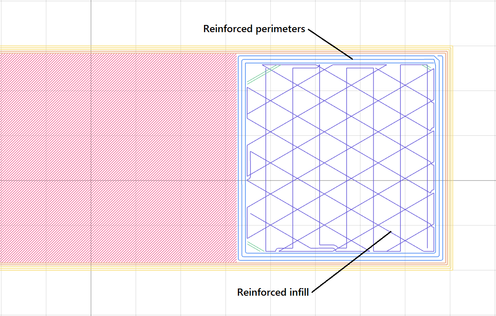
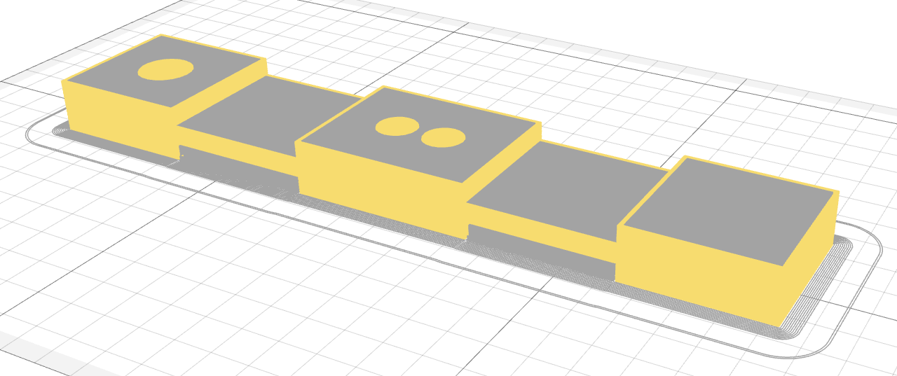
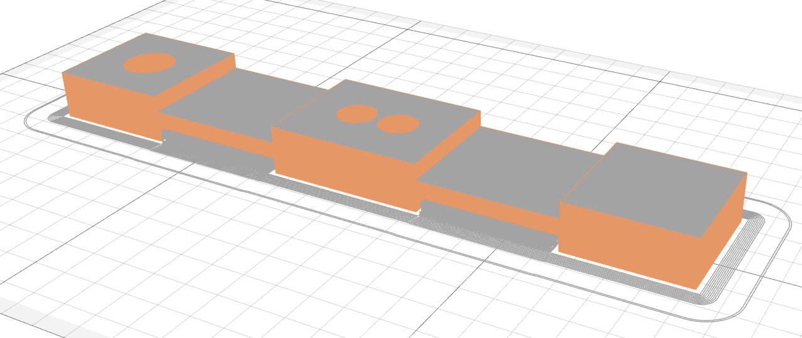
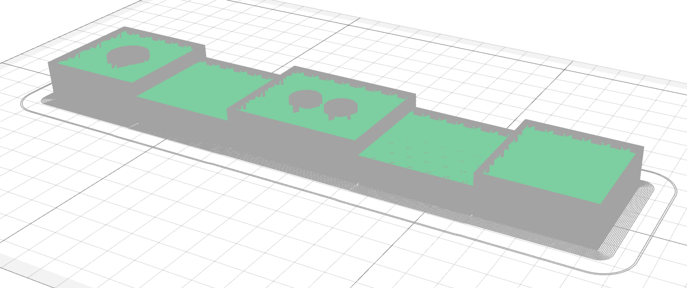
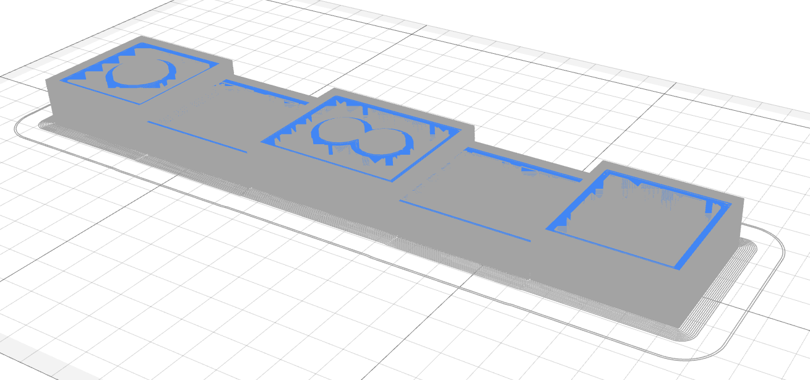
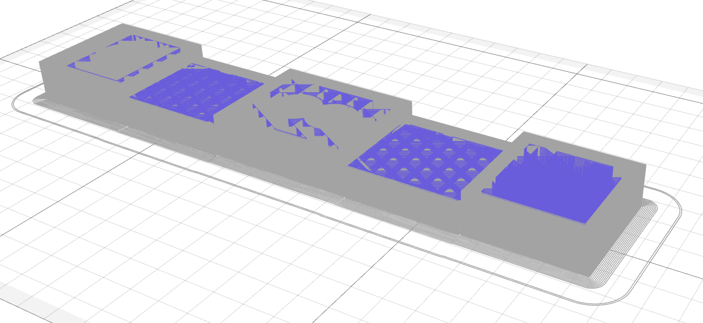
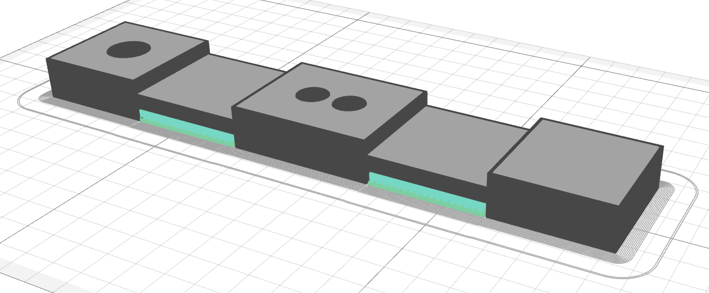
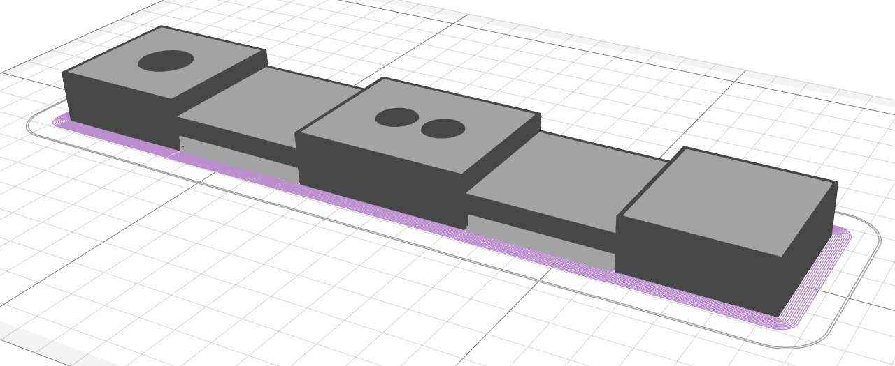
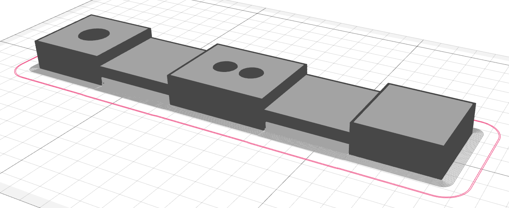

# Part Internal Structure

## Overview
Every 3d-printed part (in the ordinary case) contains shells and infills. The shell consists of solid loops of plastic that are placed along the part contour. Infills are placed inside this shell. Shells and infills are the genuine part entities. There are also auxiliary entities – brim, skirt, support, wipe tower, etc.

## Plastic part entities
The plastic part consists of external shell perimeters, internal plastic perimeters, solid infill, and cellular infill.

## Composite part entities
The composite part can additionally include reinforced perimeters and reinforced infill.

## External shell
The external shell is the shell that is formed by plastic loops placed along the outer contour of the part (including the holes). The external shell contacts the environment. It is appropriate when ES looks fine, and it should meet such requirements as chemical and wear resistance.

## Inner plastic shell
The inner plastic shell is placed next inward after the external shell. This shell adds more strength to the part shell. Unlike the external shell, the inner plastic shell has no contact with the environment, and it could be print less precisely, with higher layer thickness and higher printing speed.

## Microinfill
The microinfill fills the gaps between external and internal plastic shells. These microinfill areas are calculated automatically due to the macrolayer combining process.

## Solid infill
The solid infill forms the top and bottom surfaces of the part. If the external shell could be considered the part's vertical wall, then the solid infill could be considered a horizontal wall. Overhangs are part of solid infills. It is the first bottom layer of the solid infill in the macrolayer.

## Cellular infill
The cellular infill fills the internal volume of the part. It is usually not solid but lattice. The higher is the infill density – the higher the part's solidness and the material consumption. It could be useful to find the optimal ratio of stiffness to material consumption and printing time.

## Reinforced perimeters

The reinforced perimeters are placed along through the outer and inner contours of the part. It is possible to generate only inner or outer perimeters. Reinforcement strengthens the shell of the part and makes the part more strong and stiff. 

## Reinforced infill

The reinforced infills are placed inside the part shell. It adds strength to the part.  Infill lines can transfer load from side to side of the part. There are four types of infill – solid, rhombic grid, isotropic grid (isogrid), and anisotropic grid (anisogrid). Every infill type is appropriate for its purpose. Solid – to make the part as stiff and strong as possible at the cost of higher mass. The rhombic grid can be used in combination with reinforced perimeters to increase the stiffness of an internal volume. Isogrid is a universal infill type. It is useful when there is no sufficient information about load value and load direction. Anisogrid can be used instead of isogrid to make the part more stiff and strong in some particular direction.

## Support
Support structures are printed on the buildplate or even on the part to support overhangs from dropping down. The supports are removed after the printing. You can read more about the support structures in Aura [here](/aura/supports/).

## Brim
The brim is an auxiliary entity that surrounds the part contour on the first layer and provides secure adhesion between the part and the buildplate. Use a wider brim to glue the part to the buildplate more reliably.

## Skirt
The skirt is an auxiliary entity that is printed first. It serves to prime the plastic extruder and to achieve stable plastic flow.

