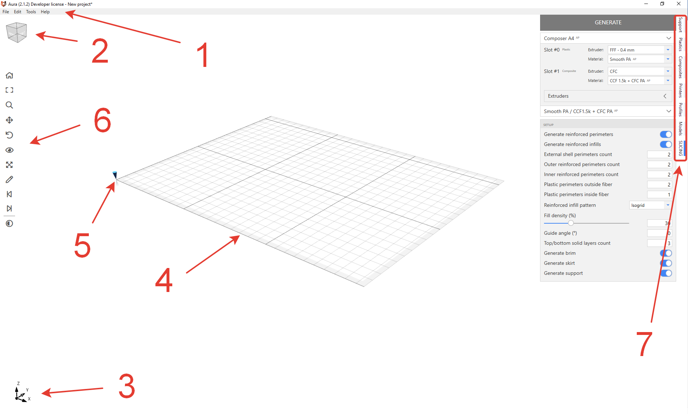
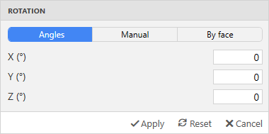
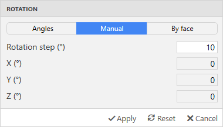
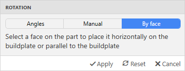

# GUI overview

This documentation describes the Open edition of the Aura slicer. Some features may be missing in Neat or Ext editions. 

## Main window

When you open Aura the main window appears.

On this screenshot of the main window, we can observe:
1.	[Main menu](./#main-menu)
2.	View cube 
3.	View axes
4.	Buildplate
5.	Origin of coordinate system
6.	[View toolbar](./#view-toolbar) (zoom, pan, rotate, etc.)
7.	[Main tabs](./#slicing-tab)

## Main menu

The main menu provides actions for project and models (File), models actions (Edit), Composer utilities (Tools), and others (Help).

### File

* **New project** – clears models, temporary settings, and make Aura slicer ready to create a new project as blank.
* **Open model** – shows open file dialog (appropriate file formats - *.stl, *.stp, *3ds, *obj) to open model and add it to the current project.
* **Open project** – shows open file dialog (appropriate file formats - *.auproj, *.auprojx) to open project. If there is work in progress, then the user will see the suggestion to save progress, and then the new project from the file will be open.
* **Save project** – saves project to the current file.
* **Save project as** – saves the project as a new file to a new location.
* **Export session** – exports all slicing settings, including printer, materials and profile settings. The resulting file can be used to slice the model using [Aura.CLI](/docs/premium/cli/).
* **Settings** – opens settings dialog, which is used to set various hotkeys, general settings, etc.

### Edit

* **Remove** – removes selected models from the project.
* **Shift** – shows form and manipulator to shift selected models in X, Y, and Z directions.
* **Put model on the table** – puts the model on the table (by most bottom point of the model).
* **Rotate** – shows form and manipulator to rotate models around X, Y, and Z-axis.
* **Resize** – shows form to resize models.
* **Clone** – clones model and place it at the same place.
* **Set layup** – shows form to define [layup structure scheme](/docs/layuprule/) for the model.
* **Set mask** – adds the selected model as a [mask](/docs/premium/masks/) to another base model.

### Tools
* **Update Composer firmware** – opens the dialog window where the user could maintain Composer firmware.

### Help
* **What’s new** – opens the window with a description of the latest Aura update.
* **License information** – opens dialog to check or change a license.
* **About** – opens a window with general information about Aura slicer.

## View toolbar
View toolbar contains tools that change view/scene.

Button                                   | Descripion
-----------------------------------------|----
              | Reset to default camera position  
   | Zoom by frame  
 | Zoom by magnifier
            | Shift view
          | Rotate view
  | Magnifier glass
           | Fit models in window size
                | Pen tool
              | Previous view
              | Next view
            | Enable masks visibility

## Slicing tab

The slicing panel is the most important. Here you can choose printer (1), materials (3), profile (2), etc. Generate button (4) serves to generate code for the current project with all chosen settings. All settings on the slicing panel could be perceived as essential settings. They have the most effect on the printing process.

 

## Models tab

 

Models panel contains:
1.	An **Add model** button that opens an open model dialog 
2.	**Model actions panel** (remove, shift, place on the table, etc.) It is only possible to apply actions to selected models.
3.	**Models list** (selected model is marked with a gray background).
4.	**Enable the model** toggle button (if the model is disabled, it will not appear in slicing).
5.	**Edit model** button (it is possible to change model’s name).

Model actions contain actions to transform models and add zones with special rules by adding layup schemes and masks.

Button                                         | Model action
-----------------------------------------------|----------------------------
                | Remove models 
                  | [Shift](./#movement) models in X,Y,Z-directions
       | Place models on the table
                | [Rotate](./#rotation) models along X,Y,Z axes
                | Resize models
                  | Clone models
    | Set [layup structure scheme](/docs/layuprule/)
                | Add model as [mask](/docs/premium/masks/)

### Movement

Movement model panel contains values for shift along X, Y, Z direction  and Apply and Cancel buttons.

 

### Rotation

Rotation action has three modes – by angles, by manual input, by face.

Rotation by angles panel contains rotate values along X, Y, Z axes and Apply, Reset and Cancel buttons.

 

Manual rotation panel contains rotation values along X, Y, Z axes (read-only), Rotation step value, and Apply, Reset, Cancel buttons. Rotation is performed by the manipulator. 

 
 

Rotation by face panel contains the instruction and Apply, Reset, Cancel buttons. The target face that the program will place horizontally is marked with orange color.

 
 

## Plastics/Composites/Printers/Profiles tabs

All stores (plastic, composite, printer, profiles) look the same. The settings store panel contains:

 

1.	Button to add a new item. 
2.	Button to import new settings items.
3.	Button to export all settings items.
4.	Button to export a particular settings item.
5.	Button to duplicate a particular settings item.
6.	Mark of settings that is recommended by Anisoprint. 

