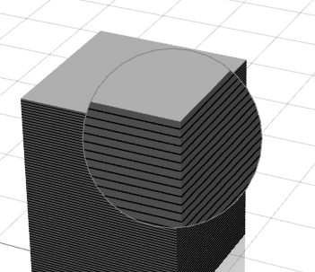
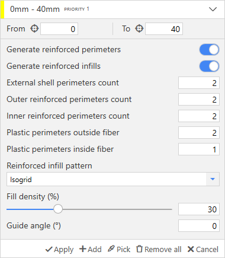
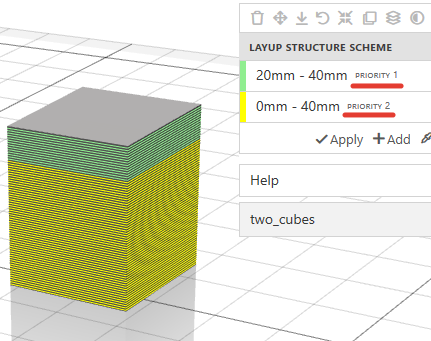

# Layup Structure Scheme

## Adding custom layup scheme

To add a custom scheme, select the model and press the **Set layup structure** button on the **Models** tab.

When you start to add a layup scheme, the layup scheme will firstly be empty and the panel will contain only Apply, Add, Pick, Remove and Cancel buttons.

 

The model will change its color, and now on the surface, it will be possible to see layer edges. All these layers are macrolayers (see [Macrolayers technology](/docs/macrolayers/)  guide).

 

The next step user is to add the first layup rule by clicking on the **Add** button. 

The new layup rule consumes all model height at once — the layup height is displayed at the top of the panel (0mm-40mm for this example).
You can set the height range manually by filling appropriate textboxes. It is also possible to click on the aim button. In this case, the pointer will change its form, and you can the select the model's layer in the viewport.  

You can set the required settings and they will be applied to the selected height range of the model during the slicing.

 

The lastly added layup rule has the most priority. It means that the layup rule with the highest priority (Priority 1 is the highest) will cover all other layup rules on the same height. You can use arrow buttons to change the priorities.

 

If all layup rules are finished, you can **Apply** changes or click on the **Cancel** button to discard all changes. It is also possible to remove all layup settings or pick the settings from another model.