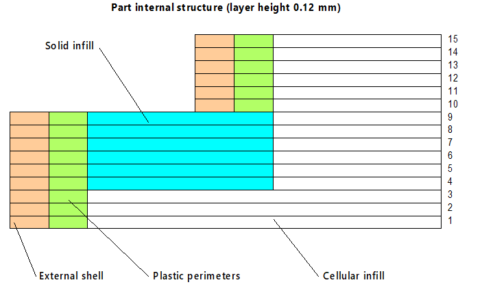
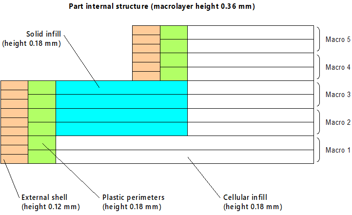
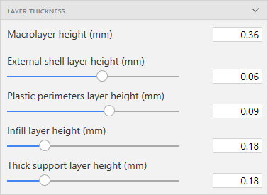

# Macrolayers Technology

## Overview
To achieve better-looking parts, users of 3d printers can reduce layer height. The most popular value of layer height for a subtle shell is about 0.1mm. On the other hand, the CCF has a diameter of 0.36mm. As the CCF can’t be printed with 0.1mm layer height, the user gains 0.36mm minimum layer height, and the printing is not fine. 

Macrolayer technology (MLT) is quite similar to the Combine infill feature, but it only combines infills, whereas it is possible to combine every part entity with Aura slicer. In the typical case, the printer should make two moves with 0.1 mm height to create a 0.2 mm line, but with the g-code generated by Aura with MLT, it takes only one movement with a layer height of 0.2 mm. As a result, printing time is reduced two times for this example. In the real world, printing time calculations could be more sophisticated.

## Details
The common 3d-printed part looks like on the picture.

All layers have the same height, and all part entities have the same height. 
The MLT makeovers this part to look like on the next picture:

As you can see, the layer height for the internal plastic perimeters and infills is larger, and these entities will be printed 1.5 times faster. 

When the part is printed with fiber, the MLT helps to achieve a fine-looking external shell and thick infill (CFC or plastic). The typical structure of the part with reinforced entities looks like in the picture below. 

Macrolayer is just an abstraction. Every printed layer is named a microlayer.

## Layer Height
Aura slicer allows setting the layer height for every particular entity. The basic rule of printing with MLT is that the macrolayer height is automatically considered as reinforced entity layer height (for reinforced perimeters and infills).

All other layer heights are calculated as a fraction of macrolayer height. For example, if the macrolayer height is 0.36 mm, the microlayer height for some entities can be 0.18 mm (1/2), 0.12 mm (1/3), 0.09 mm (1/4), etc.

The next rule of printing is regard to MLT for thin supports and microinfill. The thin support and microinfill layer heights are always equal to the external shell layer height. For example, if the external shell layer height is 0.1 mm, then the thin support height and microinfill height are also 0.1 mm. 

