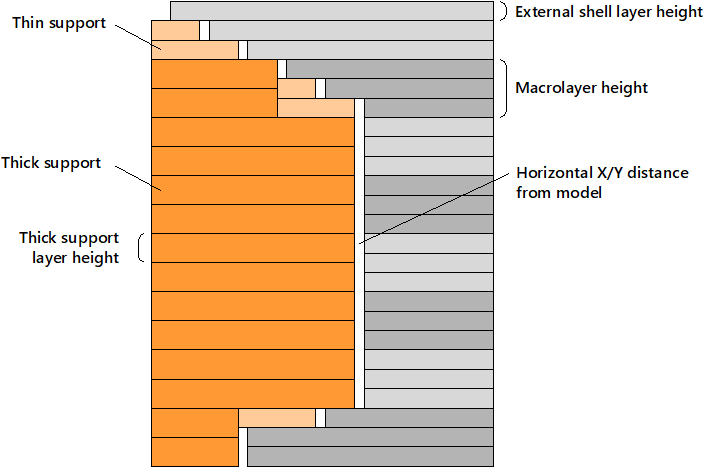
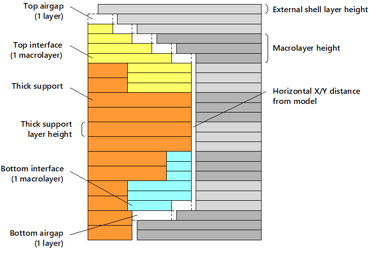
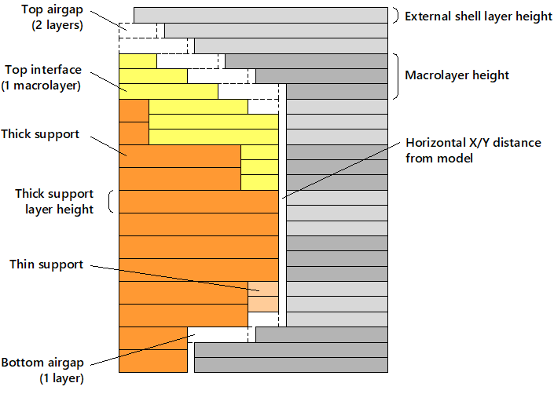
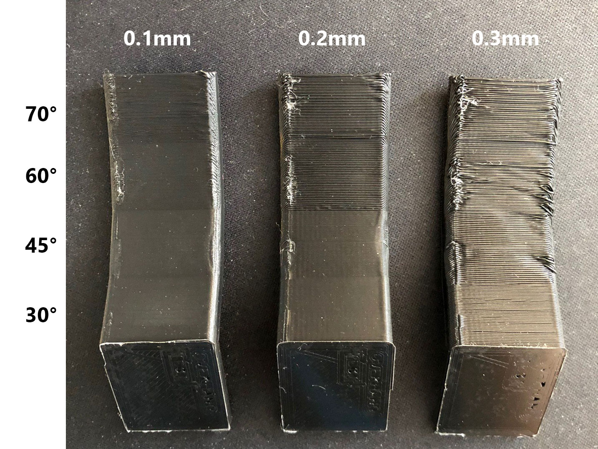
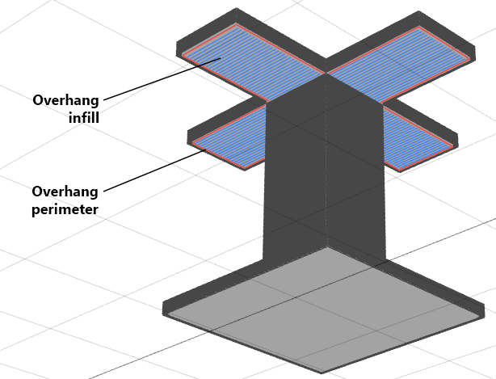

# Supports and Overhangs <Badge text="new in v1.27" type="warning"/>

::: warning
Support settings in Aura 1.27 are partially incompatible with support settings in previous versions. After update to 1.27, please review support settings in your custom profiles. Particularly, airgaps layers are now external shell layers, not thin support layers.
:::

## Supports
The part is printed from bottom to top layer by layer. That means that if the part has any overhangs, these overhangs will be printed in the air. An example of part with overhangs is on the left picture. Such large overhangs, like on the picture, can't be printed correctly - the material will fall, and the shape of the part will be broken.

To print such part correctly, you can enable the **Generate support** option. This option will add a helper structure around the part that will support overhangs. The part with the support structure is in the right picture.

## How supports are printed
The support structure consists of regular support (printed with thick and thin layers) and optional support interface (top and bottom). 

### Regular support (thick and thin)
Regular support is usually the largest part of a support structure. The print settings for regular supports are in the **Support** section of the **Profile**. 

Layers of regular support are combined into thick support layers wherever possible. Thick support layer height can be set here: **Profile > Layer thickness > Thick support layer height**.  Thin support layers appear when they can't be combined into thick support layers. Thin support is printed using **External shell layer height**. All other settings, except the layer height, are shared between thin and thick supports. Here is an internal structure of support consisting of thick and thin layers:

### Interface support
Interface support can be generated between the support structure and the part. Usually, interface support is denser to achieve a better quality of the supported part surface. The print settings for interface supports can be found in the **Interface support** section of the **Profile**. You can turn on and off top and bottom interface support independently. 

The thickness of interface supports is specified as the number of macrolayers. If you define "1", it means that at least one full macrolayer of support structure near the part will be filled with interface support. The layers thickness for interface support is the same as for external shell. Interface infill is perpendicular to regular support infill.
::: tip
We recommend having at least a couple of top interface macrolayers with dense structure. The bottom interface is not so useful.
:::

### Horizontal distance and airgaps
After the part is successfully printed, the support structures should be removed. If support structures are made of the same plastic as the part, the supports are removed mechanically. For easier removal, there should be some gaps between supports and the part. Otherwise, the part and support structure will fuse together. 

Aura has two settings that control the size of the gap between the support and the part. The first is **Horizontal X/Y distance from model**. The second is the airgaps. You can turn them on or of using **Make airgaps** setting and specify the number of airgap layers on the bottom and the top of the support structure. The layer height used for airgaps is the external shell layer height. For example, if you have the external shell layer height of 0.1 mm and two airgaps layers, the total height of the airgap will be 0.2 mm.

Here is a picture of a part with two top air layers and one bottom airgap layer:

::: tip
Turn off airgaps if you print support structures with soluble material and turn them on if the materials of support and part are the same. 
:::

## Self-support distance

Aura automatically places support structures based on the self-support distance. If the next layer overhang distance is larger than self-support distance, this layer will be supported. Selt support distance is calculated as **Self-support distance coefficient** (**Profile > Supports**) multiplied by external shell extrusion width. 

### Why distance, not angle?

A self-support angle is more frequently used, but self-support distance gives a much more accurate result. The quality of the overhang surface is influenced not only by angle but also by layer thickness and extrusion width. Support distance takes into account all these factors. 

Consider three parts with different layer height (0.1, 0.2, and 0.3 mm):

The overhang angles are the same, but the surface quality is different. This is because the overhang distance is different. Here is how the overhang distance changes for different layer height for 45° overhang (EW stands for Extrusion Width):

### How to find self-support distance for plastic material

You can find **Self-support distance coefficient** by printing a test model like on the photo above. The self-support coefficient can be found from angle and layer thickness using the following equation: 

$$k_{ov}=\frac{h\tan  \alpha }{ \delta }$$

Here $\alpha$ is self-support angle counted from the vertical plane, $h$ is layer heigth, and $\delta$ is extrusion width.

## Overhangs

Perimeters and infills in overhang areas can be printed with special settings, which can be set in the **Overhangs** section of the profile. You can set special speed and plastic flow multiplier for overhangs. Also, fan speed can be overridden for solid overhang infills.

If support generation is enabled, overhang solid infill printing direction is perpendicular to the support infill angle.

